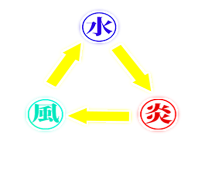

# MIRAMIRA
## 自己紹介

## 名前 顧敏民

## 学校　河原電子ビジネス専門学校
中国出身で2015年に日本に来ました、2年で日本語で人と会話することができるようになりました。
好きな食べ物はワンタンです。
# 目次
- [MIRAMIRA](#miramira)
  - [自己紹介](#自己紹介)
  - [名前 顧敏民](#名前-顧敏民)
  - [学校　河原電子ビジネス専門学校](#学校河原電子ビジネス専門学校)
- [目次](#目次)
  - [__1. 作品概要__　　　　　　　　　　　](#1-作品概要)
  - [__2.操作説明__　　](#2操作説明)
  - [__3.ソースコード__](#3ソースコード)
  - [__4.魔法__](#4魔法)
  - [__5.ナビゲーションメッシュ__　　　　　　　　](#5ナビゲーションメッシュ)
  - [__6.ゲームでこだわった部分__　](#6ゲームでこだわった部分)
## __1. 作品概要__　　　　　　　　　　　
* ミラーミラ　～己に勝つ～
* 三人称視点のアクションゲーム、ボス1体を倒すゲーム。
* __使用ゲームエンジン__ 
学校内製エンジンを使用
* __使用ツール__
  * Visual Studio 2022
  * 3ds Max 2022
  * Adobe Photoshop 2022
  * Effekseer
* __使用言語__
  * C++
* __開発環境__
  * Windows11
  * DirectX12
* __制作人数__ 
 1人
* __開発期間__ 
 2022年9月～12月

## __2.操作説明__　　
|操作|ボタン|
|:---:|:---:|
|近接攻撃|X|
|魔法攻撃|Y|
|移動|Lスティック|
|カメラ操作|Rスティック|　　　　　　　　　

## __3.ソースコード__

  
作成したソースコード

* Background.cpp
  * Background.h
* Boss.cpp
  * Boss.h
* Fade.cpp
  * Fade.h
* Game.cpp
  * Game.h
* GameCamera.cpp
  * GameCamera.h
* Mahou.cpp
  * Mahou.h
* Player.cpp
  * Player.h
* Title.cpp
  * Title.h
* Zokusei.h

## __4.魔法__
  

* プレイヤーが3つの魔法をローテーションで使用することが可能、魔法はぞれぞれに相性がある。
* 魔法を連発しないようにクールタイムを付けました。

## __5.ナビゲーションメッシュ__　　　　　　　　
3ds MAXでマップを作成したデータをレベルで読み込ませ。
地形データを元に経路探索をして、マップ上の穴を自動で避けるようにプレイヤーに向かって追いかけるように作りました。

## __6.ゲームでこだわった部分__　            
・ゲームのバランス
近距離ではめ殺しができない。
魔法で逆相性で攻撃する場合ダメージ入らないもしくは敵のHPを回復させてしまう・

  

